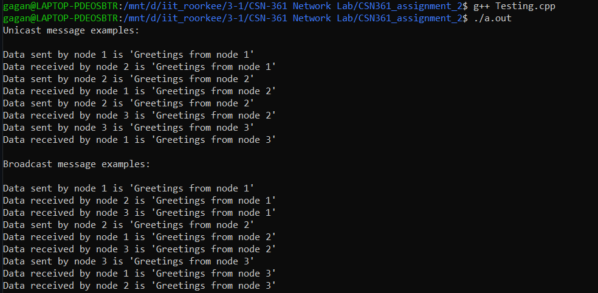

# Unicast and Broadcast Transmission Simulation for Bus Topology

This is the submission for **Assignment-2** for the **CSN-361** course.

#### Team Members

- Divyansh Agarwal (19115055)
- Gagan Sharma (19114032)
- Hardik Thami (19114035)
- Jitesh Jain (19114039)
- R Chinmay (19114067)
- Shlok Goyal (19114078)

## Contents
1. [Problem Statement](#1-problem-statement)
2. [Repository Guide](#2-repository-overview)
3. [Simulation](#3-simulation)

## 1. Problem Statement

`Problem Statement`: Simulate the way unicast/broadcast messages are transmitted over the network. Create three classes: a) Node b) Link c) Data Frame. Design a bus topology class which connects all the Nodes with links.

### Preliminaries

- **Bus Topology**: *Bus topology* is a network setup where each computer and network device is connected to a single cable or backbone.

- **Unicast Transmission**:  Message is sent to only *one* station in the network. 

- **Broadcast Transmission**: Messages are sent to *all* stations in the network.

## 2. Repository Guide

There are two header files containing the important classes required for running the simulation:

- `DataFrame.h`
    - Represents the `data packet` to be transmitted/received with:
        - `msg`: Message to be transferred
        - `msg_seq_num`: Message sequence number
        - `src_mac_addr`: Source MAC address
        - `dest_mac_addr`: Destination MAC address
    - Contains the required functions as well for creating and reading a DataFrame object as well.

- `Node&Link.h`: Contains the following two classes:
    - `Node`: 
        - Represents each node in the network with:
            - `device_id`: Device Id of the node system
            - `mac_addr`: MAC Address
            - `connected_links`: List of *Links* to which a node is connected.
        - Contains the required functions for transmitting and receiving the data.

    - `Link`: Represents the connection among the nodes.
        - Represents each link in the network with:
            - `isUniDirectional`: Boolean indicating whether flow of data frame is Unidirectional or not.
            - `connected_nodes`: List of *Nodes* which connected to a given link.
        - Contains the required function for ensuring that the `DataFrame` objects keep flowing throughout the network.

## 3. Simulation

Run the following commands:

```.bash
$ g++ Testing.cpp
$ ./a.out
```

#### Result


